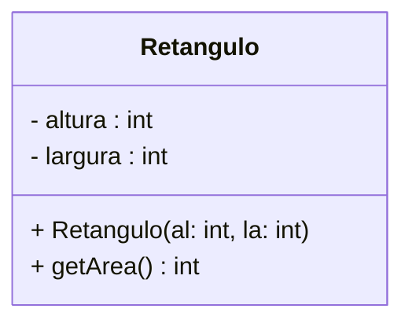
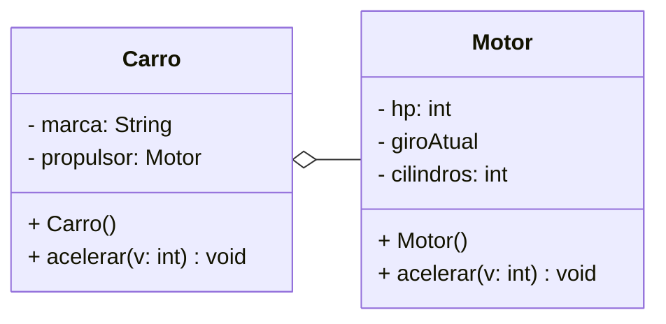

```java

public void ola(){}

```


```mermaid

classDiagram
    class Retangulo{
        - altura : int
        - largura : int
        + Retangulo(al: int, la: int)
        + getArea() int
            
    }
```


```mermaid  


classDiagram
    direction LR    
class Carro{
        - marca: String
        - propulsor: Motor
        + Carro()
        + acelerar(v: int) void
    }
    
    Carro o-- Motor
    class Motor{
        - hp: int
        - giroAtual
        - cilindros: int
        + Motor()
        + acelerar(v: int) void
    }

```