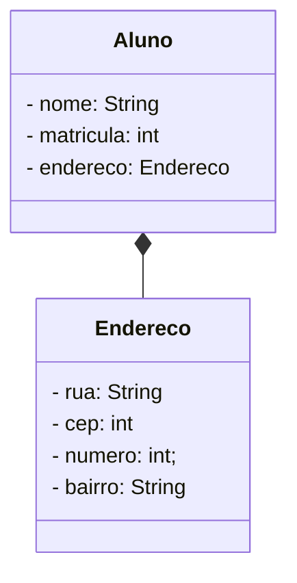

```mermaid
classDiagram
    
    class Aluno{
        - nome: String
        - matricula: int
        - endereco: Endereco }
        
        Aluno *-- Endereco
        
class Endereco{
- rua: String
- cep: int
- numero: int;
- bairro: String

 }
```

