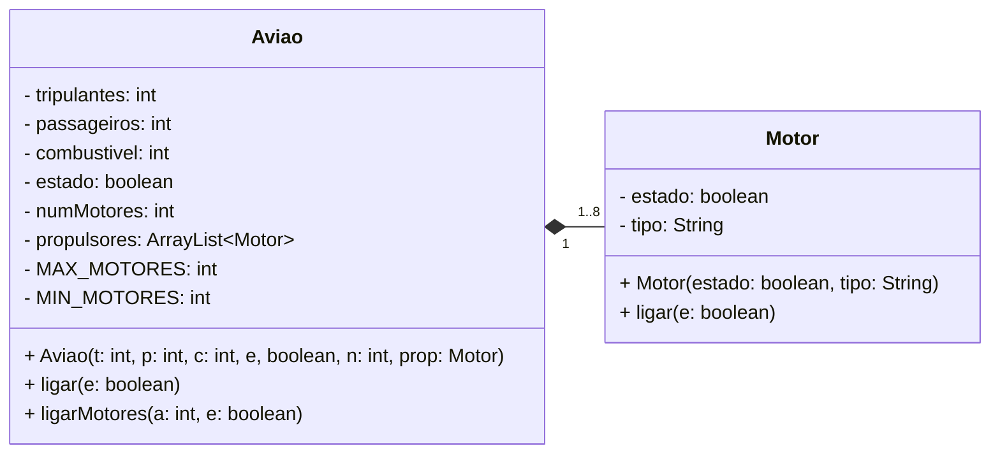

```mermaid  
classDiagram
    direction LR
    
    class Aviao{
        - tripulantes: int
        - passageiros: int
        - combustivel: int
        - estado: boolean
        - numMotores: int
        - propulsores: ArrayList~Motor~
        - MAX_MOTORES: int
        - MIN_MOTORES: int
        
        + Aviao( t: int, p: int, c: int, e, boolean, n: int, prop: Motor)
        + ligar(e: boolean)
        + ligarMotores(a: int, e: boolean)
 }
    Aviao "1" *-- "1..8" Motor
 
    class Motor{
        - estado: boolean
        - tipo: String
        
        + Motor(estado: boolean, tipo: String)
        + ligar(e: boolean)
    }


```