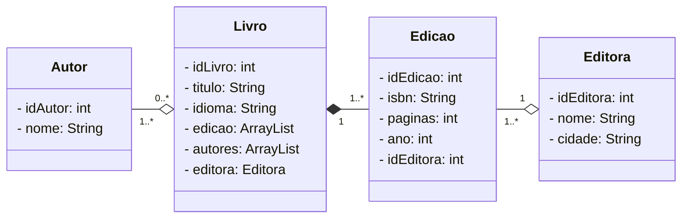
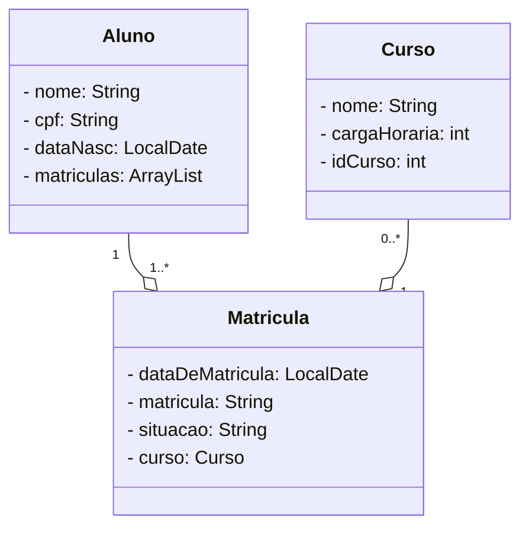
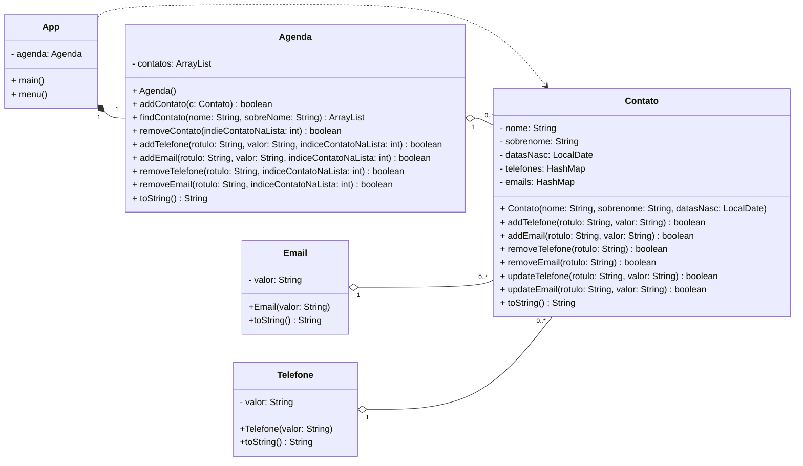

```mermaid
    classDiagram
    direction LR
    
    class Autor{
    - idAutor: int
    - nome: String 
    }

    class Livro{
        - idLivro: int
        - titulo: String
        - idioma: String
        - edicao: ArrayList<Edicoes>
        - autores: ArrayList<Autor>
        - editora: Editora
    }
    
    class Editora{
        - idEditora: int
        - nome: String
        - cidade: String
    }
    
    class Edicao{
        - idEdicao: int
        - isbn: String
        - paginas: int
        - ano: int
        - idEditora: int
    }
    
    Autor "1..*" --o "0..*" Livro
    Livro "1" *-- "1..*" Edicao
    Edicao "1..*" --o "1" Editora
    
```

```mermaid  

    classDiagram
    direction TB
    
    class Aluno{
        - nome: String
        - cpf: String
        - dataNasc: LocalDate
        - matriculas: ArrayList<Matricula>
    }
    
    class Curso{
       - nome: String
       - cargaHoraria: int
       - idCurso: int
    }

    class Matricula{
        - dataDeMatricula: LocalDate
        - matricula: String
        - situacao: String
        - curso: Curso
    }
    
    
    Aluno "1" --o "1..*" Matricula
    Curso "0..*" --o "1" Matricula
    
    
```

```mermaid

    classDiagram
    direction LR
    
    class App{
        
        - agenda: Agenda
        
        + main()
        + menu()
    }
    
    class Agenda{
        
        - contatos: ArrayList<Contato>
        
        + Agenda()
        + addContato(c: Contato) boolean
        + findContato(nome: String, sobreNome: String) ArrayList<Contato>
        + removeContato(indieContatoNaLista: int) boolean
        + addTelefone(rotulo: String, valor: String, indiceContatoNaLista: int) boolean
        + addEmail(rotulo: String, valor: String, indiceContatoNaLista: int) boolean
        + removeTelefone(rotulo: String, indiceContatoNaLista: int) boolean
        + removeEmail(rotulo: String, indiceContatoNaLista: int) boolean
        + toString() String
        
    }
    
    class Contato{
        
        - nome: String
        - sobrenome: String
        - datasNasc: LocalDate
        - telefones: HashMap<String><Telefone>
        - emails: HashMap<String><Email>
        
        + Contato(nome: String, sobrenome: String, datasNasc: LocalDate)
        + addTelefone(rotulo: String, valor: String) boolean
        + addEmail(rotulo: String, valor: String) boolean
        + removeTelefone(rotulo: String) boolean
        + removeEmail(rotulo: String) boolean
        + updateTelefone(rotulo: String, valor: String) boolean
        + updateEmail(rotulo: String, valor: String) boolean
        + toString() String

    }
    
    class Telefone{

        - valor: String
        
        +Telefone(valor: String)
        +toString() String
        
    }
    
    class Email{
        
        - valor: String
        
        +Email(valor: String)
        +toString() String
        
    }

    App ..> Contato
    App "1" *-- "1" Agenda
    Agenda "1" o-- "0..*" Contato
    Email "1" o-- "0..*" Contato
    Telefone "1" o-- "0..*" Contato

```