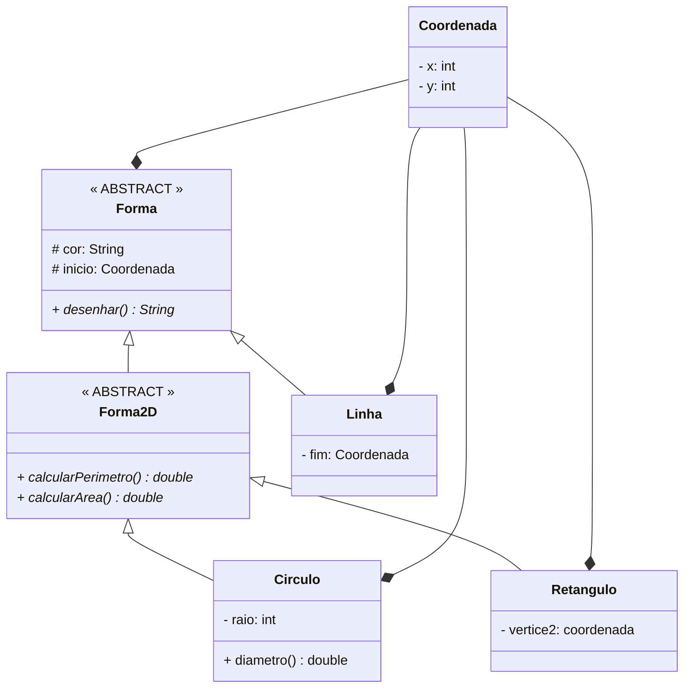
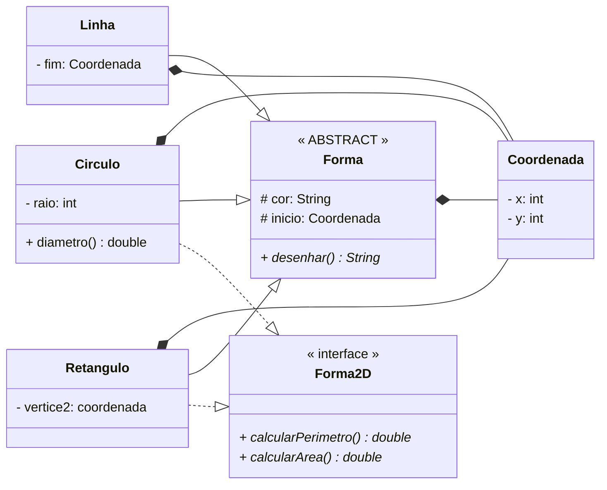

```mermaid
    classDiagram
        direction BT
    
    class Forma{ 
        << ABSTRACT >>
        # cor: String
        # inicio: Coordenada
        + desenhar() String*
      
    }
    class Forma2D{
        << ABSTRACT >>
        + calcularPerimetro() double*
        + calcularArea() double*
    }
    
    class Coordenada{
        - x: int
        - y: int
    }
    
    class Linha{
        - fim: Coordenada
    }
    
    class Circulo{
        - raio: int
        + diametro() double
    }
    
    class Retangulo{
        - vertice2: coordenada
    }
    
    Linha --|> Forma
    Circulo --|> Forma2D
    Retangulo --|> Forma2D
    Forma2D --|> Forma
    Linha *-- Coordenada
    Circulo *-- Coordenada
    Retangulo *-- Coordenada
    Forma *-- Coordenada
    
    
    
```

```mermaid
    classDiagram
        direction LR
    
    class Forma{ 
        << ABSTRACT >>
        # cor: String
        # inicio: Coordenada
        + desenhar() String*
      
    }
    class Forma2D{
        << interface >>
        + calcularPerimetro() double*
        + calcularArea() double*
    }
    
    class Coordenada{
        - x: int
        - y: int
    }
    
    class Linha{
        - fim: Coordenada
    }
    
    class Circulo{
        - raio: int
        + diametro() double
    }
    
    class Retangulo{
        - vertice2: coordenada
    }

    Forma *-- Coordenada
    Linha --|> Forma
    Circulo *-- Coordenada
    Linha *-- Coordenada
    Retangulo *-- Coordenada
    Retangulo --|> Forma
    Circulo --|> Forma
    Circulo ..|> Forma2D
    Retangulo ..|> Forma2D
    
    
    
```