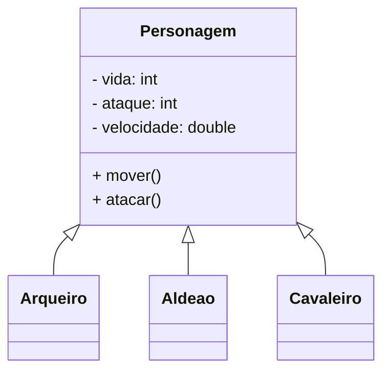

```mermaid
    classDiagram
    direction BT

        class Personagem{ 
            - vida: int
            - ataque: int
            - velocidade: double
            
            + mover()
            + atacar()
            
        }
        
        class Arqueiro{ }
        
        class Cavaleiro{ }
        
        class Aldeao{ }  


        Arqueiro --|> Personagem
        Aldeao --|> Personagem
        Cavaleiro --|> Personagem
        


```