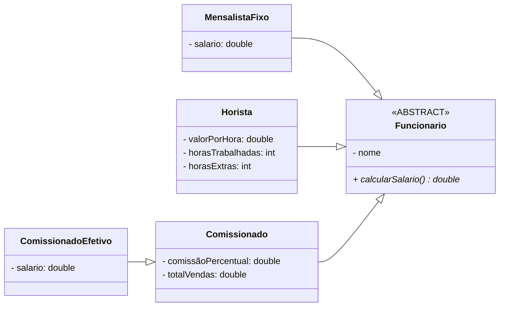

```mermaid

classDiagram
    direction LR
    
    class MensalistaFixo{ 
        - salario: double
    }
    
    class Horista{
        - valorPorHora: double
        - horasTrabalhadas: int
        - horasExtras: int
    }
    
    class Comissionado{
        - comissãoPercentual: double
        - totalVendas: double
    }
    
    class ComissionadoEfetivo{ 
        - salario: double
    }
    
   class Funcionario{
       <<ABSTRACT>>
       - nome
       + calcularSalario() double*
   }
   
        
    
   
    MensalistaFixo --|> Funcionario
    Horista --|> Funcionario
    
    Comissionado --|> Funcionario
    ComissionadoEfetivo --|> Comissionado

    
    
    


```