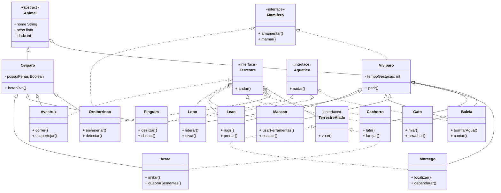

```mermaid 
classDiagram
    direction TB

    class Animal {
        <<abstract>>
        - nome String
        - peso float
        - idade int
    }

    class Mamifero {
        <<interface>>
        + amamentar()
        + mamar()
    }

    class Viviparo {
        - tempoGestacao: int
        + parir()
    }

    class Oviparo {
        - possuiPenas Boolean
        + botarOvo()
    }

    class Terrestre {
        <<interface>>
        + andar()
    }

    class Aquatico {
        <<interface>>
        + nadar()
    }

    class TerrestreAlado {
        <<interface>>
        + voar()
    }

    class Arara {
        + imitar()
        + quebrarSementes()
    }

    class Avestruz {
        + correr()
        + esquartejar()
    }

    class Baleia {
        + borrifarAgua()
        + cantar()
    }

    class Cachorro {
        + latir()
        + farejar()
    }

    class Gato {
        + miar()
        + arranhar()
    }

    class Leao {
        + rugir()
        + predar()
    }

    class Lobo {
        + liderar()
        + uivar()
    }

    class Macaco {
        + usarFerramentas()
        + escalar()
    }

    class Morcego {
        + localizar()
        + dependurar()
    }

    class Pinguim {
        + deslizar()
        + chocar()
    }

    class Ornitorrinco {
        + envenenar()
        + detectar()
    }

    Animal <|-- Viviparo
    Animal <|-- Oviparo
    Mamifero <|.. Viviparo
    Mamifero <|.. Ornitorrinco
    Oviparo <|-- Ornitorrinco
    Oviparo <|-- Avestruz
    Oviparo <|-- Pinguim
    Oviparo <|-- Arara
    Viviparo <|-- Gato
    Viviparo <|-- Cachorro
    Viviparo <|-- Morcego
    Viviparo <|-- Macaco
    Viviparo <|-- Baleia
    Viviparo <|-- Lobo
    Viviparo <|-- Leao
    Terrestre <|-- TerrestreAlado
    Aquatico <|.. Baleia
    Terrestre <|.. Ornitorrinco
    Aquatico <|.. Pinguim
    Terrestre <|.. Ornitorrinco
    Aquatico <|.. Pinguim
    TerrestreAlado <|.. Arara
    TerrestreAlado <|.. Morcego
    Terrestre <|.. Gato
    Terrestre <|.. Cachorro
    Terrestre <|.. Leao
    Terrestre <|.. Lobo
    Terrestre <|.. Macaco
    Terrestre <|.. Avestruz


```