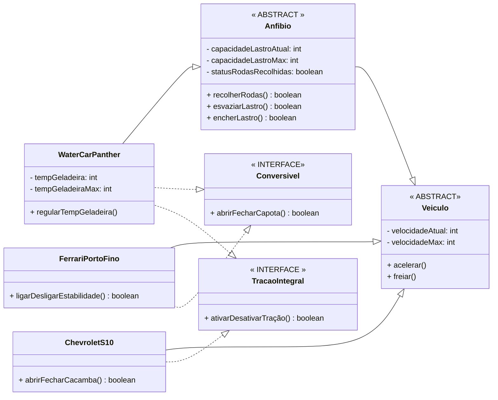

```mermaid
classDiagram
    direction RL
    
    class Veiculo{
        << ABSTRACT>>
        - velocidadeAtual: int
        - velocidadeMax: int
        
        + acelerar()
        + freiar()
    }
    
    class Anfibio { 
        << ABSTRACT >>
        
        - capacidadeLastroAtual: int
        - capacidadeLastroMax: int
        - statusRodasRecolhidas: boolean
        
        + recolherRodas() boolean
        + esvaziarLastro() boolean
        + encherLastro() boolean
    }
    
    class Conversivel { 
        << INTERFACE>>
        
       + abrirFecharCapota() boolean
    
    }
    
    class TracaoIntegral { 
        << INTERFACE >>
        
        + ativarDesativarTração() boolean
        
            
    }
    
    class FerrariPortoFino { 
        + ligarDesligarEstabilidade() boolean
    }
    
    class ChevroletS10 {
        + abrirFecharCacamba() boolean
    }
    
    class WaterCarPanther { 
        - tempGeladeira: int
        - tempGeladeiraMax: int
        + regularTempGeladeira() 
    }
    
    Veiculo  <|-- Anfibio
    Veiculo  <|--  FerrariPortoFino
    Veiculo <|--  ChevroletS10
    
    Anfibio  <|-- WaterCarPanther
    
    Conversivel <|.. FerrariPortoFino
    Conversivel <|.. WaterCarPanther
    
    TracaoIntegral <|.. ChevroletS10
    TracaoIntegral <|.. WaterCarPanther
    
    
    
    


```